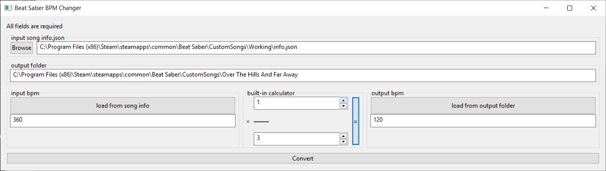

# meter-saber

for changing the BPM of a beatsaber track without changing the relative position of the boxes and walls. This is particularly useful for making 6/8 songs, but maybe useful for other purposes.

In the screenshot above, I am creating a beatmap for "Over The Hills And Far Away" by Nightwish. This song has a BPM of 135.75 and is in 6/8. Since edit-saber does not yet support 6/8 songs, I had to edit the song in 407.25 BPM (3x the true BPM). This works, but caused the boxes to come at you much faster in game than they should. This program fixes that problem by converting the BPM back to the correct tempo and the adjusting all the boxes and walls back to their correct position within the song.

This tool only creates the `DIFFICULTY_LEVEL.json` files in the output folder. You will have to copy over the other files (info.json, song.ogg, cover.jpg, etc.) yourself.

## description of sections

### input song info.json

This is the info.json inside the folder where you are editing the song.

### output folder

This is the folder that you want the BPM corrected version of the song to be saved.  
**WARNING: The contents of this folder will be overwritten!**

### input bpm

This is the current BPM of the track that needs to be adjusted. You can use the button to load the BPM from the input song info.json, or enter it directly.

### output bpm

This is the desired BPM of the output after correction. Generally it is some multiple of the input BPM.  
This value can be derived from the input BPM using the built-in calculator, loaded from the output folder (assuming it contains an info.json), or entered directly.

### built-in calculator

If you know what output BPM you want, you can totally ignore this section. It is only provided for convenience. see the "output bpm" section for more details.
